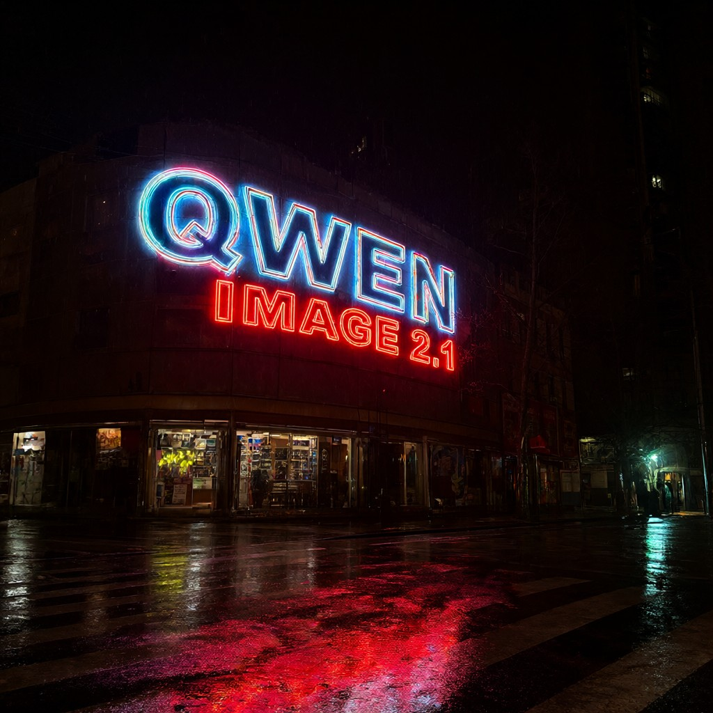

# Core ML conversion of Qwen-Image-2.1 for Apple silicon

**Generate 1024 × 1024 AI images locally on your Mac.**

[](https://github.com/devin-lai/Qwen-Image-2.1-Coreml/actions/workflows/ci.yml)
[](https://huggingface.co/devin-lai/Qwen-Image-2.1-Coreml)
[](#quickstart)
[](#quickstart)

[Quickstart](#quickstart) · [Models](https://huggingface.co/devin-lai/Qwen-Image-2.1-Coreml) · [Benchmarks](#performance-on-apple-silicon) · [Python API](#python-api) · [FAQ](#faq) · [简体中文](README.zh-CN.md)

Run [Qwen-Image-2.1](https://huggingface.co/Qwen/Qwen-Image-2.1) text-to-image
inference on Apple silicon with **Core ML**, preconverted **FP16 models**, and a
Python CLI. Four included prompt embeddings let you generate your first image
without setting up the text encoder. After downloading the packages and
installing dependencies, generation with saved embeddings runs locally without
a cloud inference API.

**Measured 2.4–2.6× faster median denoising steps than PyTorch bf16/MPS** on an
M5 MacBook Pro with 32 GB unified memory. This compares denoising steps, not
end-to-end generation; [see the environment, timings, and raw records](#performance-on-apple-silicon).

| English lettering | Chinese lettering | Wildlife | Illustration |
| :---: | :---: | :---: | :---: |
| [](assets/gallery/neon_sign.jpg) | [](assets/gallery/tea_house.jpg) | [](assets/gallery/fox.jpg) | [](assets/gallery/botanical.jpg) |

*Actual Core ML outputs: 1024 × 1024, 40 steps, seed 42. Click an image to see it
at full size. [Prompts and reproduction commands](#examples).*

- **Download and run:** six Core ML packages, a CLI, and a Python API.
- **Reuse prompt work:** cached prompt KV tensors across runs; shared transformer
  weights for prefix and decode functions.
- **Inspect the evidence:** raw benchmark JSON, reference latents, and host-side
  tests are included.

Community conversion and inference code by Devin Lai; built on Qwen's model.
[Code: Apache-2.0](LICENSE) · [Weights: Qwen Research License](LICENSE-QWEN).
The weights are for non-commercial research and evaluation; see [license details](#license-and-attribution).

## Quickstart

| Requirement | Details |
| --- | --- |
| Mac | Apple silicon, macOS 15 or newer |
| Python | 3.11–3.13; commands below use Python 3.11 |
| Storage | 14.74 GB of model packages, plus dependencies and compilation space |
| Tested hardware | M5 MacBook Pro, 32 GB unified memory |

Memory requirements on smaller machines have not been established.
Use one of the included prompts for your first run:

```bash
git clone https://github.com/devin-lai/Qwen-Image-2.1-Coreml.git
cd Qwen-Image-2.1-Coreml
python3.11 -m venv .venv
source .venv/bin/activate
python -m pip install -r requirements.txt

python download_models.py
python generate.py --out neon.png
```

`download_models.py` downloads the six packages into `models/`. Generation uses the
included neon-sign prompt. The first run also compiles models and computes the
prompt's KV cache, so it takes longer than subsequent runs.

<details>
<summary>Already downloaded the models?</summary>

Point `--models` at the directory containing the six `.mlpackage` folders.
For the nested Hugging Face checkout:

```bash
python generate.py --models ./Qwen-Image-2.1-Coreml --out neon.png
```

</details>

## Your own prompts

Install the optional text-encoding dependencies, then encode a prompt once:

```bash
python -m pip install '.[torch-reference]'
python encode_prompt.py "a lighthouse in a storm, long exposure" --name lighthouse
python generate.py --prompt-embeds assets/prompts/lighthouse.npz --out lighthouse.png
```

`encode_prompt.py` loads the upstream Qwen3-VL text encoder through Diffusers.
This requires a separate download and more memory than using the included
embeddings. The optional dependencies pin the Diffusers revision used for this
release. You can provide a local checkpoint with `--checkpoint` or the
`QWEN_IMAGE_21_CHECKPOINT` environment variable.

The generation script saves prompt KV tensors under `.cache/` and reuses them
when the prompt, layout, model files, and compute settings match. Use
`--prefix-cache none` to recompute them. Each cache takes about 67 MB.

## Examples

The gallery above uses 1024 × 1024, 40 steps, seed 42, and `cpu_and_gpu`.
All four prompt embeddings are included in `assets/prompts/`.

| Embedding | Prompt |
| --- | --- |
| [`neon_sign.npz`](assets/prompts/neon_sign.npz) | A neon shop sign that reads "QWEN IMAGE 2.1", rainy night, reflections on wet pavement |
| [`tea_house.npz`](assets/prompts/tea_house.npz) | 一块木质招牌上写着「清风茶舍」，暖黄灯笼，雨后的青石板街 |
| [`fox.npz`](assets/prompts/fox.npz) | A red fox standing in fresh snow at dawn, soft morning light |
| [`botanical.npz`](assets/prompts/botanical.npz) | A hand-drawn botanical illustration of a monstera leaf, ink on aged paper |

```bash
python generate.py --prompt-embeds assets/prompts/tea_house.npz --out tea.png
python generate.py --prompt-embeds assets/prompts/fox.npz --out fox.png
python generate.py --prompt-embeds assets/prompts/botanical.npz --out botanical.png
```

## Performance on Apple silicon

**2.4–2.6× faster denoising steps than PyTorch MPS.** The recorded Core ML runs
complete 40 denoising steps at 1024 × 1024 in **3.7–4.2 minutes**, with the VAE
adding about 1.9 seconds of warmed prediction time.

| Metric | Core ML fp16 | Reference or context |
| --- | ---: | --- |
| Median denoising step | **5.43–5.95 s** | PyTorch bf16 on MPS: 14.25 s; **2.4–2.6× speedup** |
| 40 denoising steps | **221–250 s** | 1024 × 1024, seed 42; denoising only |
| VAE prediction | **1.91 s** | 1024 × 1024 RGBA, GPU, warmed model |
| Noise-prediction PSNR vs fp32 | **71.55 dB** | PyTorch bf16: 55.80 dB; **15.8 dB higher**, about **6.1× lower RMS error** |
| Transformer package size | **14.06 GB** | Separate prefix/decode packages: 28.02 GB; **50% smaller** through shared weights |

Measured on an **M5 MacBook Pro with 32 GB unified memory**, macOS 27.0,
coremltools 9.0, and PyTorch 2.11. The prompt has 31 tokens, padded to 64;
Core ML uses `cpu_and_gpu`.

Timings come from separate sessions on the same Mac and vary with system load.
They exclude text encoding and model loading. The prompt prefix adds 28–33 s
when it needs to be computed, then can be reused from cache. The precision
comparison is one denoising step at `t = 1.0`; it measures numerical agreement
with fp32. The **full six-package download is 14.74 GB**, including the timestep
embedding and VAE decoder.

[Benchmark records and calculation details](benchmarks/README.md#performance-summary)

## Python API

```python
from qwen_image_coreml import generate, load_prompt_embeds

embeds, prompt = load_prompt_embeds("assets/prompts/neon_sign.npz")
result = generate(embeds, models_dir="models", steps=40, seed=42)
result.image.save("out.png")
print(result.timings)
```

Inference uses `coremltools`, `torch`, `numpy`, and `Pillow`. Diffusers and
Transformers are only needed for encoding new prompts and checking the ported
math against the reference implementation.

## Packages

| Package | Purpose | Size |
| --- | --- | ---: |
| `QwenImage21_Embed.mlpackage` | Timestep embedding and modulation | 0.17 GB |
| `QwenImage21_Blocks_0of4.mlpackage` | Transformer blocks 0–7 | 3.56 GB |
| `QwenImage21_Blocks_1of4.mlpackage` | Transformer blocks 8–15 | 3.49 GB |
| `QwenImage21_Blocks_2of4.mlpackage` | Transformer blocks 16–23 | 3.49 GB |
| `QwenImage21_Blocks_3of4.mlpackage` | Transformer blocks 24–31 | 3.52 GB |
| `QwenImage21_VAEDecoder_1024x1024.mlpackage` | Latents to RGBA pixels | 0.51 GB |
| **Total** | | **14.74 GB** |

Sizes are decimal GB. Each transformer package has two functions sharing one
copy of its weights:

- `prefix` processes the prompt once and returns its layer KV caches.
- `decode` processes the image tokens at each denoising step using those caches.

The denoiser uses the iOS 18 / macOS 15 target, including fused attention and
multifunction packages. The complete pipeline requires macOS 15 even though the
VAE package itself has an older specification version. iOS execution has not
been tested in this repository.

The host builds the rotary tables, attention masks, and timestep sinusoid, then
runs a flow-matching Euler sampler around the Core ML denoiser. The VAE takes
`(1, 64, 64, 64)` latents and returns `(1, 4, 1024, 1024)` RGBA values.
See [the package manifest](benchmarks/package_manifest.json) for every input and
output name, shape, and dtype.

## Measurements

The recorded environment was an M5 MacBook Pro, 32 GB, macOS 27.0,
coremltools 9.0, and PyTorch 2.11. The two saved Core ML sessions used the neon
prompt, seed 42, and 40 steps:

| Stage | Session 1 | Session 2 |
| --- | ---: | ---: |
| Prompt prefix | 27.90 s | 33.34 s |
| 40 denoising steps | 221.21 s | 249.67 s |
| VAE stage, including loading | 3.36 s | 3.57 s |
| Sum of these stages | 252.47 s | 286.58 s |

These stage sums exclude text encoding and denoiser loading. They are not total
command wall time. The raw records are
[session 1](benchmarks/pipeline_timing_session1.json) and
[session 2](benchmarks/pipeline_timing_session2.json). Runtime varies between
sessions; compare builds under the same conditions.

For one denoising step at `t = 1.0`, the recorded noise prediction PSNR against
an fp32 CPU reference was:

| Execution | PSNR |
| --- | ---: |
| PyTorch bf16 | 55.80 dB |
| PyTorch fp16 | 70.94 dB |
| Core ML fp16 | 71.55 dB |

Sources: [PyTorch precision](benchmarks/precision_step_torch.json) and
[Core ML precision](benchmarks/precision_step_coreml.json). These are numerical
checks on one input, not a general image-quality score. Small differences can
accumulate over a full sampling run; the Core ML and bf16 PyTorch outputs are
not bit-identical.

The [optimization study](benchmarks/optimization_study.txt) records tests of
folded RoPE, fused attention, weight compression, and Neural Engine execution.
Only the fp16 packages are included in this release. The study's full-step
estimates for other variants are projections from smaller graphs.

## Verification and benchmarks

```bash
python verify.py --steps 4
python verify.py --steps 40
python benchmark.py --hold --label local
```

`verify.py` recomputes the prefix and runs all six packages. It compares the
resulting latents with the shipped reference and reports the maximum absolute
difference and PSNR. The reference matched exactly in the recorded environment;
bitwise agreement is not guaranteed across hardware, OS versions, or compute
units. The VAE runs during this check, but its pixels are not compared with a
reference.

`benchmark.py --hold` measures decode latency with all four chunks resident,
as they are during generation. `--units cpu_and_gpu,cpu_and_ne` compares compute
settings. The default is `cpu_and_gpu`, which was faster in the recorded study.

To run the host-side tests:

```bash
python -m pip install -e '.[test,torch-reference]'
python -m pytest tests/ -v
```

The tests cover the rotary tables, timestep projection, sampler, cache reuse,
and download handling. They do not need model weights. CI also checks lint and
package imports; it does not run model inference.

## FAQ

**Does this run on M1, M2, M3, or M4 Macs?**

The packages target Apple silicon and macOS 15+, but the published measurements
are from an M5 MacBook Pro with 32 GB. Other chips and memory sizes need testing.
If you try one, [share a hardware report](https://github.com/devin-lai/Qwen-Image-2.1-Coreml/issues/new?template=benchmark_report.yml).

**Can I run it offline?**

Yes, with the models, dependencies, and prompt embeddings already downloaded.
Encoding new text prompts also needs the separate upstream text encoder;
see [Your own prompts](#your-own-prompts).

**Does it use the Apple Neural Engine?**

The default is `cpu_and_gpu`. Neural Engine execution was explored in the
[optimization study](benchmarks/optimization_study.txt); GPU execution was
faster in the recorded tests. The headline timings use the GPU setting.

**Can I use it from Swift or on iPhone?**

This repository supplies Python inference code and Core ML packages. It does
not include a Swift app, and iOS execution has not been tested. A native client
would need to implement the host-side pipeline around the packages.

**Why is the first run slower?**

Core ML compiles and loads the packages, and the pipeline computes the prompt
KV cache. Later runs can reuse the compiled models and prompt cache. The
published denoising times exclude loading and text encoding.

## Contribute and share your results

Running on a different Mac? [Submit a hardware benchmark](https://github.com/devin-lai/Qwen-Image-2.1-Coreml/issues/new?template=benchmark_report.yml)
with your chip, memory, macOS version, and raw timings. Reports from M1–M4 Macs
and smaller memory configurations help establish real compatibility.

Found a problem? [Report a bug](https://github.com/devin-lai/Qwen-Image-2.1-Coreml/issues/new?template=bug_report.yml).
For code changes, documentation improvements, and reproducible examples, start
with [CONTRIBUTING.md](CONTRIBUTING.md).

If this project is useful, **star the repository** to bookmark it and share the
link with someone exploring local AI image generation on Mac. When sharing an
output, include its prompt, seed, steps, and hardware so others can reproduce it.

## Scope and limitations

- The supplied packages have fixed shapes: batch size 1, 1024 × 1024, and at most
  64 encoded prompt tokens. Other shapes require another conversion.
- This release supports text-to-image generation. Image editing and
  classifier-free guidance are not implemented in the inference loop.
- The text encoder is not converted to Core ML.
- The conversion scripts are maintained separately in
  [torch2coreml](https://github.com/devin-lai/torch2coreml). The benchmark records
  are included here; the full conversion study and precision harness are not.

## License and attribution

The inference code is licensed under [Apache-2.0](LICENSE). The rotary table,
timestep projection, and sampler include code adapted from Diffusers; see
[NOTICE](NOTICE) for attribution.

The converted weights remain subject to the
[Qwen Research License Agreement](LICENSE-QWEN). That license permits
non-commercial research and evaluation; commercial use requires a separate
license from the upstream licensor. The Apache license for this repository's
code does not relicense the weights.

See [PUBLISHING.md](PUBLISHING.md) for notes on maintaining the GitHub and
Hugging Face repositories.
